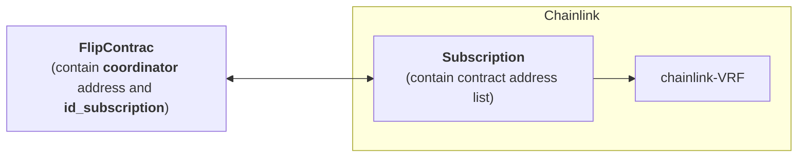

# gamble game

## generating a random number

### use ChainLink VRF

- import library of chainlink: to communicate with the VRF coordinator

```sol
import "@chainlink/contracts/src/v0.8/interfaces/VRFCoordinatorV2Interface.sol";
import "@chainlink/contracts/src/v0.8/vrf/VRFConsumerBaseV2.sol";

contract VRFD20 is VRFConsumerBaseV2 {
  uint64 s_subscriptionId;
  VRFCoordinatorV2Interface COORDINATOR;
  address vrfCoordinator = 0x8103B0A8A00be2DDC778e6e7eaa21791Cd364625;
  bytes32 s_keyHash =
    0x474e34a077df58807dbe9c96d3c009b23b3c6d0cce433e59bbf5b34f823bc56c;
  uint32 callbackGasLimit = 40000;
  uint16 requestConfirmations = 3;
  uint32 numWords = 1;
}
```

- **s_subscriptionId**: The subscription ID that this contract uses for funding requests. Initialized in the constructor.
- **COORDINATOR**: The address of the Chainlink VRF Coordinator contract that this contract will use. Initialized in the constructor.
- **vrfCoordinator**: The address of the Chainlink VRF Coordinator contract.
- **s_keyHash**: The gas lane key hash value, which is the maximum gas price you are willing to pay for a request in wei.
  It functions as an ID of the off-chain VRF job that runs in response to requests.
- **callbackGasLimit**: The limit for how much gas to use for the callback request to your contract's fulfillRandomWords function. It must be less than the maxGasLimit on the coordinator contract. Adjust this value for larger requests depending on how your fulfillRandomWords function processes and stores the received random values. If your callbackGasLimit is not sufficient, the callback will fail and your subscription is still charged for the work done to generate your requested random values.
- **requestConfirmations**: How many confirmations the Chainlink node should wait before responding. The longer the node waits, the more secure the random value is. It must be greater than the minimumRequestBlockConfirmations limit on the coordinator contract.
- **numWords**: How many random values to request.
  If you can use several random values in a single callback, you can reduce the amount of gas that you spend per random value.
  In this example, each transaction requests one random value.

## how it work

0. get coordinator address from [chainlink blog](https://docs.chain.link/vrf/v2/subscription/supported-networks)
1. go into [chainlink-vrf](https://vrf.chain.link/bnb-chain-testnet) to create new **Subscriptions** and copy its id
2. fund **Subscriptions** balance with `LINK` tokens
3. Users can then **connect multiple consuming contracts** to the **Subscriptions account**


